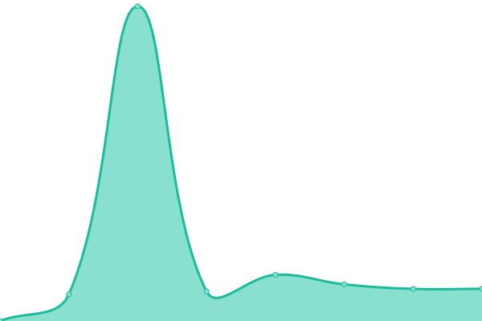

# [📈 Live Status](https://mybigday.github.io/service-uptime-beta): <!--live status--> **🟩 All systems operational**

This repository contains the open-source uptime monitor and status page for [BRICKS](https://bricks.tools), powered by [Upptime](https://github.com/upptime/upptime).

With [Upptime](https://upptime.js.org), you can get your own unlimited and free uptime monitor and status page, powered entirely by a GitHub repository. We use [Issues](https://github.com/mybigday/service-uptime-beta/issues) as incident reports, [Actions](https://github.com/mybigday/service-uptime-beta/actions) as uptime monitors, and [Pages](https://mybigday.github.io/service-uptime-beta) for the status page.

<!--start: status pages-->
<!-- This summary is generated by Upptime (https://github.com/upptime/upptime) -->
<!-- Do not edit this manually, your changes will be overwritten -->
<!-- prettier-ignore -->
| URL | Status | History | Response Time | Uptime |
| --- | ------ | ------- | ------------- | ------ |
|  [BRICKS BETA](https://display-beta.bricks.tools/api/workspace-public-health-check) | 🟩 Up | [bricks-beta.yml](https://github.com/mybigday/service-uptime-beta/commits/HEAD/history/bricks-beta.yml) | 

 491ms
     
 | 

<a href="https://mybigday.github.io/service-uptime-beta/history/bricks-beta">100.00%</a>
    

|  [BRICKS Device BETA](https://device-beta.bricks.tools/api/public-health-check) | 🟩 Up | [bricks-device-beta.yml](https://github.com/mybigday/service-uptime-beta/commits/HEAD/history/bricks-device-beta.yml) | 

 479ms
     
 | 

<a href="https://mybigday.github.io/service-uptime-beta/history/bricks-device-beta">100.00%</a>
    

|  [Data Bank BETA](https://bank-beta.bricks.tools/api/not-found) | 🟩 Up | [data-bank-beta.yml](https://github.com/mybigday/service-uptime-beta/commits/HEAD/history/data-bank-beta.yml) | 

 443ms
     
 | 

<a href="https://mybigday.github.io/service-uptime-beta/history/data-bank-beta">100.00%</a>
    

|  [Media Flow BETA](https://media-beta.bricks.tools) | 🟩 Up | [media-flow-beta.yml](https://github.com/mybigday/service-uptime-beta/commits/HEAD/history/media-flow-beta.yml) | 

 481ms
     
 | 

<a href="https://mybigday.github.io/service-uptime-beta/history/media-flow-beta">100.00%</a>
    

|  [Group (Legacy) BETA](https://group-beta.mybigday.com.tw) | 🟩 Up | [group-legacy-beta.yml](https://github.com/mybigday/service-uptime-beta/commits/HEAD/history/group-legacy-beta.yml) | 

 491ms
     
 | 

<a href="https://mybigday.github.io/service-uptime-beta/history/group-legacy-beta">100.00%</a>
    

|  [Activity Log BETA](https://activity-log-beta.bricks.tools/health) | 🟩 Up | [activity-log-beta.yml](https://github.com/mybigday/service-uptime-beta/commits/HEAD/history/activity-log-beta.yml) | 

 257ms
     
 | 

<a href="https://mybigday.github.io/service-uptime-beta/history/activity-log-beta">100.00%</a>
    

<!--end: status pages-->

[**Visit our status website →**](https://mybigday.github.io/service-uptime-beta)

## 📄 License

- Powered by: [Upptime](https://github.com/upptime/upptime)
- Code: [MIT](./LICENSE) © [BRICKS](https://bricks.tools)
- Data in the `./history` directory: [Open Database License](https://opendatacommons.org/licenses/odbl/1-0/)
